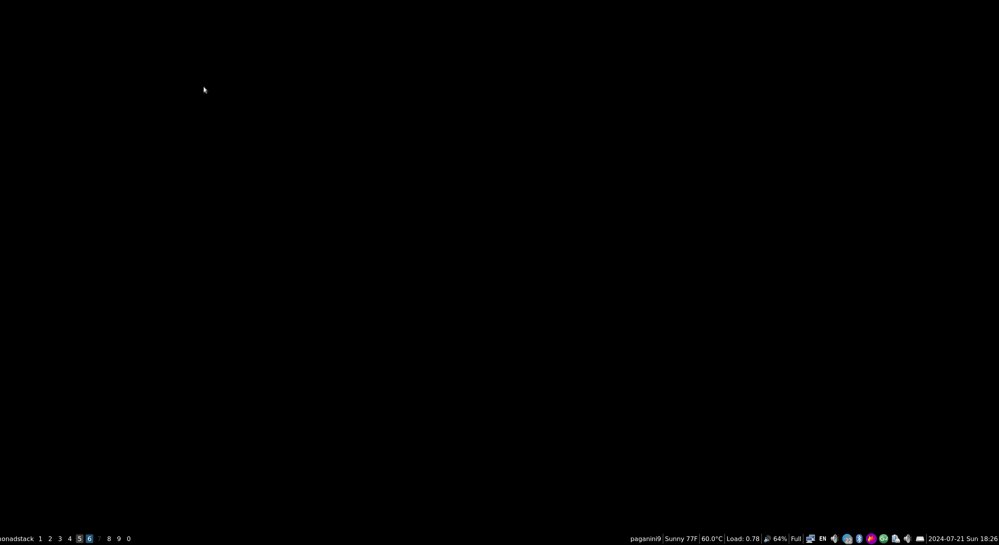

# qtile-monadstack

MonadStack is a [Qtile][https://qtile.org] layout based on the built-in
[MonadTall](https://docs.qtile.org/en/stable/manual/ref/layouts.html#monadtall)
layout, with some modifications to automatically maximize windows in the
secondary pane. This creates an effect vaguely similar to i3's "stacked" layout.

The (not so great) animation below shows it better.



This layout relies on MondaTall's `min_secondary_size` and `maximize()` to
do its task. You can change the height of "minimized" windows by instantiating
a new class with different parameters.

Notice how secondary windows auto-maximize as they get focused. It's also
possible to turn off this feature by calling `toggle_auto_maximize` or `reset`
from a key binding.

## Installation

Installation is simple. Just clone this repository somewhere in your machine and
copy the module to your qtile configuration directory:

```bash
git clone https://github.com/marcopaganini/qtile-monadstack.git
cp qtile-monadstack/monadstack.py ~/.config/qtile
```

Another option is to download the layout module directly with curl:

```bash
curl https://raw.githubusercontent.com/marcopaganini/qtile-monadstack/master/monadstack.py \
  > ~/.config/qtile/monadstack.py
```

Once the module is inside your `~/.config/qtile` directory, edit your main
qtile configuration file (usually `~/.config/qtile/config.py` and add an import
line at the beginning of the file:

```
import monadstack
```

Then locate your `layouts` line and add something like:

```python
    layouts = [
            MonadStack(min_secondary_size=40),
    ]
```

It's also a good idea to define a keybinding to toggle auto-maximization:

```
Key([mod, "shift"], "s", lazy.layout.toggle_auto_maximize())
```

## Bonus Layout

This module also defines the `MonadStackRight` layout, which is just like
`MonadStack` but has the secondary windows on the left side of the screen by
default.

## Feedback

I've been using a similar version of this class for quite some time, but
decided to improve it a bit and make it public. Bugs may exist. Feedback and
PRs appreciated.
